# TMA Faults

| **Requested by:** | **AURA**   |
| ----------------- | ---------- |
| **Doc. Code**     |            |
| **Editor:**       | A. Izpizua |
| **Approved by:**  | J. Garcia  |

## Index

- [TMA Faults](#tma-faults)
  - [Index](#index)
  - [Introduction](#introduction)
  - [Fault list for each subsystem](#fault-list-for-each-subsystem)
    - [ACW](#acw)
      - [Fault list](#fault-list)
      - [Warning list](#warning-list)
    - [Azimuth](#azimuth)
      - [Fault list](#fault-list-1)
      - [Warning list](#warning-list-1)
    - [Azimuth Drives Thermal](#azimuth-drives-thermal)
      - [Fault list](#fault-list-2)
      - [Warning list](#warning-list-2)
    - [Balancing](#balancing)
      - [Fault list](#fault-list-3)
      - [Warning list](#warning-list-3)
    - [Azimuth Cabinet 0101](#azimuth-cabinet-0101)
      - [Fault list](#fault-list-4)
      - [Warning list](#warning-list-4)
    - [CCW](#ccw)
      - [Fault list](#fault-list-5)
      - [Warning list](#warning-list-5)
    - [Elevation](#elevation)
      - [Fault list](#fault-list-6)
      - [Warning list](#warning-list-6)
    - [Elevation Drives Thermal](#elevation-drives-thermal)
      - [Fault list](#fault-list-7)
      - [Warning list](#warning-list-7)
    - [Encoder System](#encoder-system)
      - [Fault list](#fault-list-8)
      - [Warning list](#warning-list-8)
    - [Locking Pin](#locking-pin)
      - [Fault list](#fault-list-9)
      - [Warning list](#warning-list-9)
    - [Main Axis](#main-axis)
      - [Fault list](#fault-list-10)
      - [Warning list](#warning-list-10)
    - [Main Cabinet (AZ-0001)](#main-cabinet-az-0001)
      - [Fault list](#fault-list-11)
      - [Warning list](#warning-list-11)
    - [Mirror Covers](#mirror-covers)
      - [Fault list](#fault-list-12)
      - [Warning list](#warning-list-12)
    - [Mirror Cover Locks](#mirror-cover-locks)
      - [Fault list](#fault-list-13)
      - [Warning list](#warning-list-13)
    - [Main Power Supply](#main-power-supply)
      - [Fault list](#fault-list-14)
      - [Warning list](#warning-list-14)
    - [OSS](#oss)
      - [Fault list](#fault-list-15)
      - [Warning list](#warning-list-15)
    - [Deployable Platforms](#deployable-platforms)
      - [Fault list](#fault-list-16)
      - [Warning list](#warning-list-16)
    - [Modbus Auxiliary Boxes (TMA\_AZ\_DZ\_CBT\_0001, TMA\_AZ\_PD\_CBT\_0001, TMA\_AZ\_PD\_TRM\_0001, TMA\_EL\_PD\_CBT\_0001, TMA\_EL\_PD\_CBT\_0002)](#modbus-auxiliary-boxes-tma_az_dz_cbt_0001-tma_az_pd_cbt_0001-tma_az_pd_trm_0001-tma_el_pd_cbt_0001-tma_el_pd_cbt_0002)
      - [Fault list](#fault-list-17)
      - [Warning list](#warning-list-17)
    - [TopEndChiller](#topendchiller)
      - [Fault list](#fault-list-18)
  - [Fault tree for each subsystem](#fault-tree-for-each-subsystem)
    - [Main Axes](#main-axes)
      - [Azimuth individual fault tree](#azimuth-individual-fault-tree)
      - [Elevation individual fault tree](#elevation-individual-fault-tree)
    - [ACW](#acw-1)
    - [Encoder System](#encoder-system-1)
    - [Main Power Supply](#main-power-supply-1)
    - [OSS](#oss-1)
    - [Azimuth Drives Thermal](#azimuth-drives-thermal-1)
    - [Balancing](#balancing-1)
    - [Azimuth Cabinet 0101](#azimuth-cabinet-0101-1)
    - [CCW](#ccw-1)
    - [Elevation Drives Thermal](#elevation-drives-thermal-1)
    - [Locking Pin](#locking-pin-1)
    - [Main Cabinet (AZ-0001)](#main-cabinet-az-0001-1)
    - [Mirror Covers](#mirror-covers-1)
    - [Mirror Cover Locks](#mirror-cover-locks-1)
    - [Deployable Platforms](#deployable-platforms-1)
    - [Modbus Auxiliary Boxes (TMA\_AZ\_DZ\_CBT\_0001, TMA\_AZ\_PD\_CBT\_0001, TMA\_AZ\_PD\_TRM\_0001, TMA\_EL\_PD\_CBT\_0001, TMA\_EL\_PD\_CBT\_0002)](#modbus-auxiliary-boxes-tma_az_dz_cbt_0001-tma_az_pd_cbt_0001-tma_az_pd_trm_0001-tma_el_pd_cbt_0001-tma_el_pd_cbt_0002-1)
    - [Top End Chiller](#top-end-chiller)

## Introduction

This document contains the fault and warning list for each subsystem in the TMA. Additionally, it also contains a fault
tree for each subsystem.

## Fault list for each subsystem

This section contains the corresponding fault and warning list for each subsystem.

### ACW

#### Fault list

| Code | Name | Type | Description | Possible Solution |
| ---- | ---- | ---- | ----------- | ----------------- |
| 309 | Critical Speed Limit | Alarm | The critical speed limit was violated | Reset alarm |
| 310 | Positive Software Limit | Alarm | The positive software limit is overcomed | Disable the software limit using the settings and Reset alarm |
| 311 | Negative Software Limit | Alarm | The negative software limit is overcomed | Disable the software limit using the settings and Reset alarm |
| 312 | Azimuth Cable Wrap Safety | Alarm | A safety issue has ocurred in the azimuth cable wrap module | Check the safety cause and reset it if necessary then Reset alarm |
| 314 | Critical Azimuth Deviation Limit | Alarm | The maximum allowed deviation between azimuth position and azimuth cable wrap position was overcomed | Center the ACW to the Azimuth position and Reset alarm |
| 315 | Main Cabinet Off | Alarm | A fault ocurred at the Main Cabinet that is going to power off the cabinet. | Reset the alarm from the main temperature cabinet and then Reset alarm |
| 370 | Bosch Power Supply Off | Alarm | The bosch power supply is off , therefore the systems that use the bosch drives cannot be used. | Check that the bosch power supply is on then Reset alarm |

#### Warning list

| Code | Name | Type | Description |
| ---- | ---- | ---- | ----------- |
| 301 | Speed Limit | Warning | The speed limit was violated |
| 306 | Lubrication Level 1 Low | Warning | The motor 1 lubrication level is low |
| 307 | Lubrication Level 2 Low | Warning | The motor 2 lubrication level is low |
| 313 | Azimuth Deviation Limit | Warning | The allowed deviation between azimuth position and azimuth cable wrap position was overcomed |

### Azimuth

#### Fault list

| Code | Name | Type | Description | Possible Solution |
| ---- | ---- | ---- | ----------- | ----------------- |
| 100 | TMAPXI-AXESPXI communication failure | Alarm | The communication between TMAPXI and AXESPXI is down. This was detected by the AXESPXI and the axis is in fault | Reset alarm, if this doesn't work reboot the AXES PXI and then reset the alarm |
| 101 | SoftMotion Axis Fault | Alarm | The softmotion axis went to fault | This is usually due to other fault, check other faults from the system Reset alarm |
| 102 | STO | Alarm | The STO for the axis is active | Check the safety cause and reset it if necessary then Reset alarm |
| 104 | Overspeed | Alarm | Overspeed Alarm ocurred | Reset alarm |
| 105 | Axis Control Loop Finished Late | Alarm | The controller axis controller loop takes to much time to execute. The counter increases its value by 1000, when an issue is detected, decreasing by 1 each no problem iteration | Check the temperature in the main cabinet AZ-0001 then reset alarm |
| 105 | NoNewData | Alarm | New data does not arrive from EIB | Check that the network is OK between the EIB and the AXIS PXI Reset alarm |
| 110 | Positive Software limit | Alarm | The positive software limit has been exceeded | Disable the software limit using the settings and Reset alarm |
| 111 | Negative Software limit | Alarm | The negative software limit has been exceeded | Disable the software limit using the settings and Reset alarm |
| 112 | Positive Limit Switch | Alarm | The positive limit switch has been reached by axis | Disable the software limit using the settings and Reset alarm |
| 112 | Negative Limit Switch | Alarm | The negative limit switch has been reached by axis | Disable the software limit using the settings and Reset alarm |
| 113 | Negative Adjustable Software limit | Alarm | The negative adjustable software limit has been exceeded | Disable the software limit using the settings and Reset alarm |
| 113 | Positive Adjustable Software limit | Alarm | The positive adjustable software limit has been exceeded | Disable the software limit using the settings and Reset alarm |
| 120 | Critical AZCW Deviation Limit | Alarm | The maximum allowed deviation between azimuth cable wrap position and azimuth position was overcomed | Move the ACW to the center of Azimuth Reset alarm and then do a home |
| 131 | Negative Softmotion Software limit | Alarm | The negative software limit in the axis softmotion has been exceeded | Disable the software limit using the settings and Reset alarm |
| 132 | Positive Softmotion Software limit | Alarm | The positive software limit in the axis softmotion has been exceeded | Disable the software limit using the settings and Reset alarm |
| 133 | Following Error | Alarm | The axis detect and excessive deviation from the command | Reset alarm |
| 136 | Axis Fault | Alarm | Axis control algorithm detected a fault. Possible causes are: NoNewData, Too Many Drives in Fault, AXESPXI and TMAPXI comm fault or software error. Check if NoNewData or PXIs comm alarms are active, otherwise this means drives fault | Reset alarm, if this doesn't work reboot the AXES PXI and then reset the alarm |
| 160 | Extrapolation Time Exceeded | Alarm | The defined extrapolation time was exceeded. | Check that the CSC sends tracking commands Reset alarm |
| 180 | Axis Communication Not Connected | Alarm | The status or telemetry task for the axis is NOT connected. | Reset alarm, if this doesn't work reboot the AXES PXI and then reset the alarm |
| 181 | Axis Communication Tasks Not Running | Alarm | The status or telemetry task for the axis is not running. | Reset alarm, if this doesn't work reboot the AXES PXI and then reset the alarm |
| 190 | Axis Externally Disabled | Alarm | The axis was disabled externally without using the enable command. | This is caused by an STO Reset alarm and safety cause |
| 198 | Software error in CW Tracking loop | Alarm | Cable wrap tracking command not sent. | This is caused by the ACW being in fault, usually another alarm will be present from the ACW |
| 199 | Internal Alarm in Azimuth OMT | Alarm | The description may vary, as this is a generic code for multiple alarms a subset of the possibilities is listed below | Reset alarm |

Possible additional errors coming with `101`:

| Code  | Name                              | Type  | Description                                            | Possible Solution |
| ----- | --------------------------------- | ----- | ------------------------------------------------------ | ----------------- |
| -8108 | Software Error in axis management | Alarm | Tracking algorithm has an invalid output (NaN or  Inf) | Reset alarm       |
| -8109 | Software Error in axis management | Alarm | Slewing algorithm has an invalid output (NaN or  Inf)  | Reset alarm       |
| -8110 | Software Error in axis management | Alarm | Slewing profile timing error                           | Reset alarm       |

Possible descriptions for alarm code `199`:

- The request tracking speed is greater than the maximum allowed tracking speed.
- Tracking command buffer is full. Continuous move command was ignored.
- Zero speed setpoint received in a speed profile command.
- Set initial position cannot be performed while the trajectory generator is enabled.
- Speed setpoint higher than maximum speed.
- Discrete move already being executed.
- Command not allowed in current operation mode.
- Operation cannot be changed while system is enabled.
- System already enabled.
- Slewing command detected during slewing move.
- Trajectory generator is disabled. Command ignored.
- The continuous command time setpoint is lower than current time.

#### Warning list

| Code | Name | Type | Description |
| ---- | ---- | ---- | ----------- |
| 104 | Overspeed | Warning | Overspeed Warning ocurred |
| 105 | NoNewData | Warning | New data does not arrive from EIB |
| 120 | Active Drives | Warning | At least one drive is not active |
| 120 | AZCW Deviation Limit | Warning | The maximum allowed deviation between azimuth cable wrap position and azimuth position was overcomed |
| 150 | Past Time in Tracking Command | Warning | A tracking command was received with a past timestamp demand value. |

### Azimuth Drives Thermal

#### Fault list

| Code | Name | Type | Description | Possible Solution |
| ---- | ---- | ---- | ----------- | ----------------- |
| 1601 | ValveFaulty | Alarm | The valve of the drives temperature controller is faulty. | Change the ethercat line to configuration and back to active then. Reset alarm, if persists check the valve |
| 1602 | TemperatureTooHigh | Alarm | The temperature is too high. | Reset alarm |
| 1603 | ValveMovementTimeout | Alarm | The mixing valve takes too much time to get close the desired position. Check the valve status | Reset alarm |
| 1604 | NotEnoughSensors | Alarm | The minimum allowable temperature sensors in the group is reached and the temperature control could not work. Check temperature sensors | Change the ethercat line to configuration and back to active then. Reset alarm, if persists check the sensors |
| 1611 | Main Cabinet Off | Alarm | A fault ocurred at the Main Cabinet that is going to power off the cabinet. | Reset the alarm from the main temperature cabinet and then Reset alarm |

#### Warning list

| Code | Name | Type | Description |
| ---- | ---- | ---- | ----------- |
| 1602 | TemperatureTooLow | Warning | The temperature is  too low.|
| 1604 | 1TemperatureSensorFailure | Warning | One of the temperature sensors in the group is failing. Check temperature sensors. |
| 1605 | 2TemperatureSensorFailure | Warning | Two of the temperature sensors in the group is failing. Check temperature sensors. |
| 1606 | 3TemperatureSensorFailure | Warning | Three of the temperature sensors in the group is failing. Check temperature sensors. |
| 1607 | 4TemperatureSensorFailure | Warning | Three of the temperature sensors in the group is failing. Check temperature sensors. |

### Balancing

#### Fault list

| Code | Name | Type | Description | Possible Solution |
| ---- | ---- | ---- | ----------- | ----------------- |
| 1101 | Critical Speed Limit | Alarm | The critical speed limit was violated. | Reset alarm |
| 1102 | Positive Position Limit | Alarm | The maximum position limit was violated. | Disable the software limit using the settings and Reset alarm |
| 1103 | Negative Position Limit | Alarm | The minimum position limit was violated. | Disable the software limit using the settings and Reset alarm |
| 1110 | Balancing System Safety | Alarm | A safety issue has occurred in the balancing system module. | Check the safety cause and reset it if necessary then Reset alarm |
| 1111 | Main Cabinet Off | Alarm | A fault ocurred at the Main Cabinet that is going to power off the cabinet. | Reset the alarm from the main temperature cabinet and then Reset alarm |
| 1170 | Bosch Power Supply Off | Alarm | The bosch power supply is off , therefore the systems that use the bosch drives cannot be used. | Check that the bosch power supply is on then Reset alarm |

#### Warning list

| Code | Name | Type | Description |
| ---- | ---- | ---- | ----------- |
| 1101 | Speed Limit | Warning | The speed limit was violated. |

### Azimuth Cabinet 0101

#### Fault list

| Code | Name | Type | Description | Possible Solution |
| ---- | ---- | ---- | ----------- | ----------------- |
| 1901 | ValveFaulty | Alarm | The valve of the drives temperature controller is faulty. | Change the ethercat line to configuration and back to active then. Reset alarm, if persists check the valve |
| 1902 | TemperatureTooHigh | Alarm | The temperature is too high. | Reset alarm |
| 1903 | ValveMovementTimeout | Alarm | The mixing valve takes too much time to get close the desired position. Check the valve status | Reset alarm |
| 1904 | NotEnoughSensors | Alarm | The minimum allowable temperature sensors in the group is reached and the temperature control could not work. Check temperature sensors | Change the ethercat line to configuration and back to active then. Reset alarm, if persists check the sensors |
| 1911 | Main Cabinet Off | Alarm | A fault ocurred at the Main Cabinet that is going to power off the cabinet. | Reset the alarm from the main temperature cabinet and then Reset alarm |

#### Warning list

| Code | Name | Type | Description |
| ---- | ---- | ---- | ----------- |
| 1902 | TemperatureTooLow | Warning | The temperature is  too low. |
| 1904 | 1TemperatureSensorFailure | Warning | One of the temperature sensors in the group is failing. Check temperature sensors. |

### CCW

#### Fault list

| Code | Name | Type | Description | Possible Solution |
| ---- | ---- | ---- | ----------- | ----------------- |
| 1002 | Positive Limit Switch Pressed | Alarm | The positive limit switch is pressed | Disable the software limit using the settings and Reset alarm |
| 1003 | Negative Limit Switch Pressed | Alarm | The negative limit switch is pressed | Disable the software limit using the settings and Reset alarm |
| 1009 | Critical Speed Limit | Alarm | The critical speed limit was violated | Reset alarm |
| 1010 | Positive Software Limit | Alarm | The positive software limit is overcomed | Disable the software limit using the settings and Reset alarm |
| 1011 | Negative Software Limit | Alarm | The negative software limit is overcomed | Disable the software limit using the settings and Reset alarm |
| 1012 | Camera Cable Wrap Safety | Alarm | A safety issue has ocurred in the camera cable wrap module | Check the safety cause and reset it if necessary then Reset alarm |
| 1070 | Bosch Power Supply Off | Alarm | The bosch power supply is off , therefore the systems that use the bosch drives cannot be used. | Check that the bosch power supply is on then Reset alarm |

#### Warning list

| Code | Name | Type | Description |
| ---- | ---- | ---- | ----------- |
| 1001 | Speed Limit | Warning | The speed limit was violated |
| 1006 | Lubrication Level 1 Low | Warning | The motor 1 lubrication level is low |
| 1007 | Lubrication Level 2 Low | Warning | The motor 2 lubrication level is low |

### Elevation

#### Fault list

| Code | Name | Type | Description | Possible Solution |
| ---- | ---- | ---- | ----------- | ----------------- |
| 400 | TMAPXI-AXESPXI communication failure | Alarm | The communication between TMAPXI and AXESPXI is down. This was detected by the AXESPXI and the axis is in fault | Reset alarm, if this doesn't work reboot the AXES PXI and then reset the alarm |
| 401 | SoftMotion Axis Fault | Alarm | The softmotion axis went to fault | This is usually due to other fault, check other faults from the system Reset alarm |
| 402 | STO | Alarm | The STO for the axis is active | Check the safety cause and reset it if necessary then Reset alarm |
| 404 | Overspeed | Alarm | Overspeed Alarm ocurred | Reset alarm |
| 405 | Axis Control Loop Finished Late | Alarm | The controller axis controller loop takes to much time to execute. The counter increases its value by 1000, when an issue is detected, decreasing by 1 each no problem iteration | Check the temperature in the main cabinet AZ-0001 then reset alarm |
| 405 | NoNewData | Alarm | New data does not arrive from EIB | Check that the network is OK between the EIB and the AXIS PXI Reset alarm |
| 410 | Positive Software limit | Alarm | The positive software limit has been exceeded | Disable the software limit using the settings and Reset alarm |
| 411 | Negative Software limit | Alarm | The negative software limit has been exceeded | Disable the software limit using the settings and Reset alarm |
| 412 | Negative Limit Switch | Alarm | The negative limit switch has been reached by axis | Disable the software limit using the settings and Reset alarm |
| 412 | Negative Operational Limit Switch | Alarm | The negative Operational limit switch has been reached by axis | Disable the software limit using the settings and Reset alarm |
| 412 | Positive Limit Switch | Alarm | The positive limit switch has been reached by axis | Disable the software limit using the settings and Reset alarm |
| 412 | Positive Operational Limit Switch | Alarm | The positive Operational limit switch has been reached by axis | Disable the software limit using the settings and Reset alarm |
| 413 | Positive Adjustable Software limit | Alarm | The positive adjustable software limit has been exceeded | Disable the software limit using the settings and Reset alarm |
| 413 | Negative Adjustable Software limit | Alarm | The negative adjustable software limit has been exceeded | Disable the software limit using the settings and Reset alarm |
| 431 | Negative Softmotion Software limit | Alarm | The negative software limit in the axis softmotion has been exceeded | Disable the software limit using the settings and Reset alarm |
| 432 | Positive Softmotion Software limit | Alarm | The positive software limit in the axis softmotion has been exceeded | Disable the software limit using the settings and Reset alarm |
| 433 | Following Error | Alarm | The axis detect and excessive deviation from the command | Reset alarm |
| 436 | Axis Fault | Alarm | Axis control algorithm detected a fault. Possible causes are: NoNewData, Too Many Drives in Fault, AXESPXI and TMAPXI comm fault or software error. Check if NoNewData or PXIs comm alarms are active, otherwise this means drives fault | Reset alarm, if this doesn't work reboot the AXES PXI and then reset the alarm |
| 460 | Extrapolation Time Exceeded | Alarm | The defined extrapolation time was exceeded. | Check that the CSC sends tracking commands Reset alarm |
| 480 | Axis Communication Not Connected | Alarm | The status or telemetry task for the axis is NOT connected. | Reset alarm, if this doesn't work reboot the AXES PXI and then reset the alarm |
| 481 | Axis Communication Tasks Not Running | Alarm | The status or telemetry task for the axis is not running. | Reset alarm, if this doesn't work reboot the AXES PXI and then reset the alarm |
| 490 | Axis Externally Disabled | Alarm | The axis was disabled externally without using the enable command. |  This is caused by an STO Reset alarm and safety cause |
| 499 | Internal Alarm in Azimuth OMT | Alarm | The description may vary, as this is a generic code for multiple alarms a subset of the possibilities is listed below | Reset alarm |

Possible additional errors coming with `401`:

| Code  | Name                              | Type  | Description                                            | Possible Solution |
| ----- | --------------------------------- | ----- | ------------------------------------------------------ | ----------------- |
| -8108 | Software Error in axis management | Alarm | Tracking algorithm has an invalid output (NaN or  Inf) | Reset alarm       |
| -8109 | Software Error in axis management | Alarm | Slewing algorithm has an invalid output (NaN or  Inf)  | Reset alarm       |
| -8110 | Software Error in axis management | Alarm | Slewing profile timing error                           | Reset alarm       |

Possible descriptions for alarm code `499`:

- The request tracking speed is greater than the maximum allowed tracking speed.
- Tracking command buffer is full. Continuous move command was ignored.
- Zero speed setpoint received in a speed profile command.
- Set initial position cannot be performed while the trajectory generator is enabled.
- Speed setpoint higher than maximum speed.
- Discrete move already being executed.
- Command not allowed in current operation mode.
- Operation cannot be changed while system is enabled.
- System already enabled.
- Slewing command detected during slewing move.
- Trajectory generator is disabled. Command ignored.
- The continuous command time setpoint is lower than current time.

#### Warning list

| Code | Name | Type | Description |
| ---- | ---- | ---- | ----------- |
| 404 | Overspeed | Warning | Overspeed Warning ocurred |
| 405 | NoNewData | Warning | New data does not arrive from EIB |
| 420 | Active Drives | Warning | At least one drive is not active |
| 450 | Past Time in Tracking Command | Warning | A tracking command was received with a past timestamp demand value. |

### Elevation Drives Thermal

#### Fault list

| Code | Name | Type | Description | Possible Solution |
| ---- | ---- | ---- | ----------- | ----------------- |
| 1701 | ValveFaulty | Alarm | The valve of the drives temperature controller is faulty. | Change the ethercat line to configuration and back to active then. Reset alarm, if persists check the valve |
| 1702 | TemperatureTooHigh | Alarm | The temperature is too high. | Reset alarm |
| 1703 | ValveMovementTimeout | Alarm | The mixing valve takes too much time to get close the desired position. Check the valve status | Reset alarm |
| 1704 | NotEnoughSensors | Alarm | The minimum allowable temperature sensors in the group is reached and the temperature control could not work. Check temperature sensors | Change the ethercat line to configuration and back to active then. Reset alarm, if persists check the sensors |
| 1711 | Main Cabinet Off | Alarm | A fault ocurred at the Main Cabinet that is going to power off the cabinet. | Reset the alarm from the main temperature cabinet and then Reset alarm |

#### Warning list

| Code | Name | Type | Description |
| ---- | ---- | ---- | ----------- |
| 1702 | TemperatureTooLow | Warning | The temperature is  too low.|
| 1704 | 1TemperatureSensorFailure | Warning | One of the temperature sensors in the group is failing. Check temperature sensors. |
| 1705 | 2TemperatureSensorFailure | Warning | Two of the temperature sensors in the group is failing. Check temperature sensors. |
| 1706 | 3TemperatureSensorFailure | Warning | Three of the temperature sensors in the group is failing. Check temperature sensors. |

### Encoder System

#### Fault list

| Code | Name | Type | Description | Possible Solution |
| ---- | ---- | ---- | ----------- | ----------------- |
| 702 | Azimuth encoder heads bellow critical value | Alarm | The available encoder heads do not allow to continue the operation | Check the tape and clean if necessary Reset alarm |
| 704 | Elevation encoder heads bellow critical value | Alarm | The available encoder heads do not allow to continue the operation | Check the tape and clean if necessaryReset alarm |
| 706 | Frames loss | Alarm | UPD receiving data loop is loosing frames. The frames are not consecutive. | Check the ethernet connection between the EIB and the PXI Reset alarm |
| 708 | Received Data not OK | Alarm | Not all configured data packets are received from EIB or checksum is not valid | Reset alarm |
| 710 | Bad format udp packet | Alarm | Data received in upd port does not well formatted. The amount of bytes is not corresponding to configured data packet number for EIB | Reset alarm |
| 711 | UDP timeout | Alarm | Encoder UPD loop does not receive any data in 500 ms | Reset alarm |
| 710  | Timeout | Alarm | Depends on the command in execution | Depends on the command faulted |

#### Warning list

| Code | Name | Type | Description | Possible Solution |
| ---- | ---- | ---- | ----------- | ----------------- |
| 701 | Azimuth lost encoder heads | Warning | One or more encoder heads are lost, but the system can continue working | - |
| 703 | Elevation lost encoder heads | Warning | One or more encoder heads are lost, but the system can continue working | - |
| 705 | Frames loss | Warning | UPD receiving data loop is loosing frames. The frames are not consecutive. | - |
| 707 | Received Data not OK | Warning | Not all configured data packets are received from EIB or checksum is not valid | - |
| 709 | Bad format udp packet | Warning | Data received in upd port does not well formatted. The amount of bytes is not corresponding to configured data packet number for EIB | - |
| 755  | Reference mark error | Warning | Reference mark calculation error for heads: failed head names.Possible a reference mark is missing | Check the tape and clean if necessary |
| 756  | Not all heads have a valid reference | Warning | When calculating the head reference value, the heads failed head names failed. They will not be used for absolute position calculation | Try homing again. Some positions are badly calculated for azimuth, the calculated position is 360 deg away from the actual position, and can't not be used |

### Locking Pin

#### Fault list

| Code | Name | Type | Description | Possible Solution |
| ---- | ---- | ---- | ----------- | ----------------- |
| 1401 | Locking Pin Safety | Alarm | A safety issue has occurred in the locking pin module. | Check the safety cause and reset it if necessary then Reset alarm |
| 1402 | Critical Speed Limit | Alarm | The critical speed limit was violated. | Reset alarm |
| 1403 | Position Negative Limit | Alarm | The Minimum position was violated | Disable the software limit using the settings and Reset alarm |
| 1404 | Position Positive Limit | Alarm | The maximum position was violated | Disable the software limit using the settings and Reset alarm |
| 1411 | Main Cabinet Off | Alarm | A fault ocurred at the Main Cabinet that is going to power off the cabinet. | Reset the alarm from the main temperature cabinet and then Reset alarm |
| 1470 | Bosch Power Supply Off | Alarm | The bosch power supply is off , therefore the systems that use the bosch drives cannot be used. | Check that the bosch power supply is on then Reset alarm |

#### Warning list

| Code | Name | Type | Description |
| ---- | ---- | ---- | ----------- |
| 1402 | Speed Limit | Warning | The speed limit was violated. |

### Main Axis

These relate to both [Azimuth](#azimuth) and [Elevation](#elevation) but are covered in a separated section as they are
single affecting both.

#### Fault list

| Code | Name | Type | Description | Possible Solution |
| ---- | ---- | ---- | ----------- | ----------------- |
| 55 | Axis CMD Writer | Alarm | Axis command writer has issue | Reset alarm, if this doesn't work reboot the AXES PXI and then reset the alarm |
| 56 | Axis CMDs not connected | Alarm | Axis command connection is down | Reset alarm, if this doesn't work reboot the AXES PXI and then reset the alarm |
| 57 | OSSAlarm | Alarm | The OSS is in Fault state | Reset alarm |
| 58 | Phase Power Supply Alarm | Alarm | The Phase Power Supply, supply for main axis, is in fault state | Reset alarm |
| 65 | Main Cabinet Off | Alarm | A fault ocurred at the Main Cabinet that is going to power off the cabinet. | Reset the alarm from the main temperature cabinet and then Reset alarm |

#### Warning list

| Code | Name | Type | Description | Possible Solution |
| ---- | ---- | ---- | ----------- | ----------------- |
| 51 | Phase drives status not connected | Warning | Phase drives status connection is down | Reset alarm, if this doesn't work reboot the AXES PXI and then reset the alarm |
| 52 | Phase drives status reader | Warning | Phase drives status task has an issue | Reset alarm, if this doesn't work reboot the AXES PXI and then reset the alarm |
| 53 | Phase drives telemetry not connected | Warning | Phase drives telemetry connection is down | Reset alarm, if this doesn't work reboot the AXES PXI and then reset the alarm |
| 54 | Phase drives telemetry reader | Warning | Phase drives telemetry reader task has an issue | Reset alarm, if this doesn't work reboot the AXES PXI and then reset the alarm |

### Main Cabinet (AZ-0001)

#### Fault list

| Code | Name | Type | Description | Possible Solution |
| ---- | ---- | ---- | ----------- | ----------------- |
| 1301 | Cabinet Fan Faulty | Alarm | The heat exchanger fan is faulty. | Reset alarm, if persistent check the cabinet fan |
| 1302 | Cabinet Heater Faulty | Alarm | The cabinet heater is faulty. | Reset alarm, if persistent check the cabinet heater |
| 1303 | Cabinet Valve Faulty | Alarm | The cabinet valve is faulty. | Reset alarm, if persistent check the cabinet valve |
| 1304 | Internal Temperature Sensor 1 Failed | Alarm | The temperature sensor that measures the internal temperature in the main cabinet (1) has failed. Its value is not valid. | Change the ethercat line to configuration and back to active then. Reset alarm, if persists check the sensors |
| 1305 | Internal Temperature Sensor 2 Failed | Alarm | The temperature sensor that measures the internal temperature in the main cabinet (2) has failed. Its value is not valid. | Change the ethercat line to configuration and back to active then. Reset alarm, if persists check the sensors |
| 1306 | Surface Temperature Sensor Failed | Alarm | The temperature sensor that measures the surface temperature in the main cabinet has failed. Its value is not valid. | Change the ethercat line to configuration and back to active then. Reset alarm, if persists check the sensors |
| 1312 | Backup Temperature Sensor Failed | Alarm | The backup temperature sensor used when RMC not working failed.  If the RMC controller communication is lost, the backup hysteresis based controller will not work. | Change the ethercat line to configuration and back to active then. Reset alarm, if persists check the sensors |
| 1313 | RMC connection error | Alarm | The connection with the RMC controller was lost. The system is controlled through an hysteresis regulator. | Reset alarm, if persistent check the connection to the RMC, the Watlow temperature controller |
| 1350 | Critical Temperature Drop | Alarm | Cabinet Temperature decreased below critical limit. | Reset alarm |
| 1351 | Critical Temperature Increase  | Alarm | Cabinet Temperature increased above critical limit. | Reset alarm |

#### Warning list

| Code | Name | Type | Description |
| ---- | ---- | ---- | ----------- |
| 1308 | Temperature Drop | Warning | Cabinet Temperature decreased below limit. |
| 1309 | Temperature Increase sensor 1 | Warning | Cabinet Temperature increased above limit in sensor 1 |
| 1310 | Surface Temperature Drop | Warning | Surface temperature decreased below limit. |
| 1311 | Surface Temperature Increase | Warning | Surface temperature increased beyond limit. |
| 1314 | Temperature Increase sensor 2 | Warning | Cabinet Temperature increased above limit in sensor 2 |

### Mirror Covers

#### Fault list

| Code | Name | Type | Description | Possible Solution |
| ---- | ---- | ---- | ----------- | ----------------- |
| 901 | Mirror Cover Safety | Alarm | A safety issue has occurred in the mirror cover module. | Check the safety cause and reset it if necessary then Reset alarm |
| 903 | Critical Speed Limit | Alarm | This event triggers if the parameter "Critical Max Motor Velocity" is exceeded. | Reset alarm |
| 908 | ColisionEvent | Alarm | This event triggers if any MC are going to collision. | Check visually that the mirror covers are being deployed properly, they must move two at a time and the first two must be completely deployed or retracted, then Reset alarm |
| 911 | Main Cabinet Off | Alarm | A fault ocurred at the Main Cabinet that is going to power off the cabinet. | Reset the alarm from the main temperature cabinet and then Reset alarm |
| 970 | Bosch Power Supply Off | Alarm | The bosch power supply is off , therefore the systems that use the bosch drives cannot be used. | Check that the bosch power supply is on then Reset alarm |

#### Warning list

| Code | Name | Type | Description |
| ---- | ---- | ---- | ----------- |
| 904 | Speed Limit | Warning | This event triggers if the parameter "Motor Max Velocity" is exceeded. |

### Mirror Cover Locks

#### Fault list

| Code | Name | Type | Description | Possible Solution |
| ---- | ---- | ---- | ----------- | ----------------- |
| 1501 | Mirror Cover Safety | Alarm | A safety issue has occurred in the mirror cover module. | Check the safety cause and reset it if necessary then Reset alarm |
| 1503 | Critical Speed Limit | Alarm | This event triggers if the parameter "Critical Max Motor Velocity" is exceeded. | Reset alarm |
| 1511 | Main Cabinet Off | Alarm | A fault ocurred at the Main Cabinet that is going to power off the cabinet. | Reset the alarm from the main temperature cabinet and then Reset alarm |
| 1570 | Bosch Power Supply Off | Alarm | The bosch power supply is off , therefore the systems that use the bosch drives cannot be used. | Check that the bosch power supply is on then Reset alarm |

#### Warning list

| Code | Name | Type | Description |
| ---- | ---- | ---- | ----------- |
| 1504 | Speed Limit | Warning | This event triggers if the parameter "Motor Max Velocity" is exceeded. |

### Main Power Supply

#### Fault list

| Code | Name | Type | Description | Possible Solution |
| ---- | ---- | ---- | ----------- | ----------------- |
| 600 | MaxCurrent | Alarm | The maximum allowed current was exceed. | Reset alarm |
| 601 | MinVoltage | Alarm | The minimum allowed voltage was lost. | Reset alarm, if persists check [here](https://gitlab.tekniker.es/publico/3151-lsst/documentation/maintenancedocuments/mainpowersupply/motordcvoltagedropcauses) |
| 602 | Main Power Supply Safety | Alarm | A safety issue has occurred in the Main Power Supply module. | Check the safety cause and reset it if necessary then Reset alarm |
| 611 | Main Cabinet Off | Alarm | A fault ocurred at the Main Cabinet that is going to power off the cabinet. | Reset the alarm from the main temperature cabinet and then Reset alarm |

#### Warning list

| Code | Name | Type | Description |
| ---- | ---- | ---- | ----------- |
| 600 | MaxCurrent | Warning | The maximum allowed current was exceed. |
| 601 | MinVoltage | Warning | The minimum allowed voltage was lost. |

### OSS

#### Fault list

| Code | Name | Type | Description | Possible Solution |
| ---- | ---- | ---- | ----------- | ----------------- |
| 801 | Observation Sequence | Alarm | The OSSs observation sequence returned an alarm | Reset alarm |
| 802 | Cooling System | Alarm | The OSSs cooling system returned an alarm | Reset alarm |
| 803 | Main Pump System | Alarm | The OSSs main pump  system returned an alarm | Reset alarm |
| 804 | Circulation System | Alarm | The OSSs circulation system returned an alarm | Reset alarm |
| 806 | Connection Lost | Alarm | The connection with the OSS has been lost | Check connection with the OSS Reset alarm, if persistent reboot AUX PXI |
| 810 | OSS Malfunction | Alarm | A safety issue has occurred in the OSS | Check the safety cause and reset it if necessary then Reset alarm |
| 811 | Main Cabinet Off | Alarm | A fault ocurred at the Main Cabinet that is going to power off the cabinet. | Reset the alarm from the main temperature cabinet and then Reset alarm |
| 812 | Cabinet AZ_OS_CBT_5001 High temperature | Alarm | The temperature of the Cabinet AZ_OS_CBT_5001 is too high | Reset alarm |
| 813 | Cabinet AZ_OS_CBT_5001 Low temperature | Alarm | The temperature of the Cabinet AZ_OS_CBT_5001  is too Low | Reset alarm |
| 814 | Cabinet EL_OS_CBT_5001 High temperature | Alarm | The temperature of the Cabinet EL_OS_CBT_5001  is too high | Reset alarm |
| 815 | Cabinet EL_OS_CBT_5001 Low temperature | Alarm | The temperature of the Cabinet EL_OS_CBT_5001  is too Low | Reset alarm |
| 816 | Cabinet EL_OS_CBT_5002 High temperature | Alarm | The temperature of the Cabinet EL_OS_CBT_5002  is too high | Reset alarm |
| 817 | Cabinet EL_OS_CBT_5002 Low temperature | Alarm | The temperature of the Cabinet EL_OS_CBT_5002  is too Low | Reset alarm |
| 818 | Emergency Stop | Alarm | Emergency Stop performed in the OSS | Check the safety cause and reset it if necessary then Reset alarm |
| 819 | Hard Stop | Alarm | Hard Stop performed in the OSS | Check the safety cause and reset it if necessary then Reset alarm |
| 821 | OSS Modbus fail | Alarm | The Modbus communication with the OSS is down | Check connection with the OSS Reset alarm, if persistent reboot AUX PXI |
| 830 | TemperatureTooHighAzCBT | Alarm | The temperature of the AZ OS CBT 5001 is too high. | Reset alarm |
| 830 | Soft Stop | Alarm | Soft Stop performed in the OSS | Check the safety cause and reset it if necessary then Reset alarm |
| 831 | TemperatureTooHighELCBT1 | Alarm | The temperature of the EL OS CBT 5001 is too high. | Reset alarm |
| 832 | TemperatureTooHighELCBT2 | Alarm | The temperature of the EL OS CBT 5002 is too high. | Reset alarm |

#### Warning list

| Code | Name | Type | Description |
| ---- | ---- | ---- | ----------- |
| 830 | TemperatureTooLowAzCBT | Warning | The temperature of the AZ OS CBT 5001 is too low. |
| 831 | TemperatureTooLowELCBT2 | Warning | The temperature of the EL OS CBT 5002 is too low. |
| 831 | TemperatureTooLowELCBT1 | Warning | The temperature of the EL OS CBT 5001 is too low. |

### Deployable Platforms

#### Fault list

| Code | Name | Type | Description | Possible Solution |
| ---- | ---- | ---- | ----------- | ----------------- |
| 1201 | Critical Speed Limit | Alarm | This event triggers if the parameter "Platform Max Critical Velocity" is exceeded. | Reset alarm |
| 1207 | Deployable Platform Safety | Alarm | A safety issue has occurred in the deployable platform module. | Check the safety cause and reset it if necessary then Reset alarm |
| 1211 | Main Cabinet Off | Alarm | A fault ocurred at the Main Cabinet that is going to power off the cabinet. | Reset the alarm from the main temperature cabinet and then Reset alarm |
| 1270 | Bosch Power Supply Off | Alarm | The bosch power supply is off , therefore the systems that use the bosch drives cannot be used. | Check that the bosch power supply is on then Reset alarm |

#### Warning list

| Code | Name | Type | Description |
| ---- | ---- | ---- | ----------- |
| 1201 | Speed Limit | Warning | This event triggers if the parameter "Platform Max Velocity" is exceeded. |

### Modbus Auxiliary Boxes (TMA_AZ_DZ_CBT_0001, TMA_AZ_PD_CBT_0001, TMA_AZ_PD_TRM_0001, TMA_EL_PD_CBT_0001, TMA_EL_PD_CBT_0002)

#### Fault list

| Code | Name | Type | Description | Possible Solution |
| ---- | ---- | ---- | ----------- | ----------------- |
| 2601 | CabinetControllerNotOK | Alarm | The modbus temperature controller is in alarm. | Check state of the controller and the temperature, then Reset alarm |
| 2602 | ConnectionNotOK | Alarm | The modbus temperature controller connection is not okay. | Check if the cabinet is on. If the cabinet is on check the communication to the controller, then Reset alarm |
| 2603 | TemperatureTooHigh | Alarm | The temperature is out of the allowed band. | Reset alarm |

#### Warning list

| Code | Name | Type | Description |
| ---- | ---- | ---- | ----------- |
| 2603 | TemperatureTooLow | Warning | The temperature is  too low. |

### TopEndChiller

#### Fault list

| Code | Name | Type | Description | Possible Solution |
| ---- | ---- | ---- | ----------- | ----------------- |
| 2201 | 0201 3 Way valve Failure | Alarm | Failure of the 0201 3 way valve | Reset alarm |
| 2202 | 0202 3 Way valve Failure | Alarm | Failure of the 0202 3 way valve | Reset alarm |
| 2203 | ActionTimeout | Alarm | Timeout when power on/off or change to remote/local mode | Reset alarm |
| 2204 | Air Compressed Valve Failure | Alarm | Failure of the compressed air valve | Reset alarm |
| 2205 | CameraFansFailure | Alarm | The fans of the camera section have a failure | Reset alarm |
| 2206 | Electrical Cabinet 1 Control Failure | Alarm | Failure of the temperature controller in electrical cabinet 1 | Reset alarm |
| 2207 | Electrical Cabinet 2 Control Failure | Alarm | Failure of the temperature controller in electrical cabinet 2 | Reset alarm |
| 2208 | Electrical Cabinet 3 Control Failure | Alarm | Failure of the temperature controller in electrical cabinet 3 | Reset alarm |
| 2209 | Electrical Cabinet 4 Control Failure | Alarm | Failure of the temperature controller in electrical cabinet 4 | Reset alarm |
| 2210 | Heat Exchanger 1 Fan Failure | Alarm | Failure in the fans of the heat exchanger 1 | Reset alarm |
| 2211 | Heat Exchanger 2 Fan Failure | Alarm | Failure in the fans of the heat exchanger 2 | Reset alarm |
| 2212 | Humidity 0501 | Alarm | Humidity of the sensor 0501 out of range | Reset alarm |
| 2213 | Humidity 0502 | Alarm | Humidity of the sensor 0502 out of range | Reset alarm |
| 2214 | Humidity 0504 | Alarm | Humidity of the sensor 0504 out of range | Reset alarm |
| 2215 | Humidity 0505 | Alarm | Humidity of the sensor 0505 out of range | Reset alarm |
| 2216 | M2FansFailure | Alarm | The fans of the M2 section have a failure | Reset alarm |
| 2217 | PLC Malfunction | Alarm | The PLC for Top End chiller is working bad | Reset alarm |
| 2218 | Temperature 0501 | Alarm | Temperature of the sensor 0501 out of range | Reset alarm |
| 2219 | Temperature 0502 | Alarm | Temperature of the sensor 0502 out of range | Reset alarm |
| 2220 | Temperature 0504 | Alarm | Temperature of the sensor 0504 out of range | Reset alarm |
| 2221 | Temperature 0505 | Alarm | Temperature of the sensor 0505 out of range | Reset alarm |
| 2222 | Temperature 0506 | Alarm | Temperature of the sensor 0506 out of range | Reset alarm |
| 2223 | Temperature 0507 | Alarm | Temperature of the sensor 0507 out of range | Reset alarm |
| 2224 | Temperature Alarm Cabinet 1 | Alarm | Alarm temperature for electrical cabinet 1 | Reset alarm |
| 2225 | Temperature Alarm Cabinet 2 | Alarm | Alarm temperature for electrical cabinet 2 | Reset alarm |
| 2226 | Temperature Alarm Cabinet 3 | Alarm | Alarm temperature for electrical cabinet 3 | Reset alarm |
| 2227 | Temperature Alarm Cabinet 4 | Alarm | Alarm temperature for electrical cabinet 4 | Reset alarm |

## Fault tree for each subsystem

This section contains the corresponding fault tree for each subsystem.

### Main Axes

This section contains the faults that affect both Azimuth and Elevation.

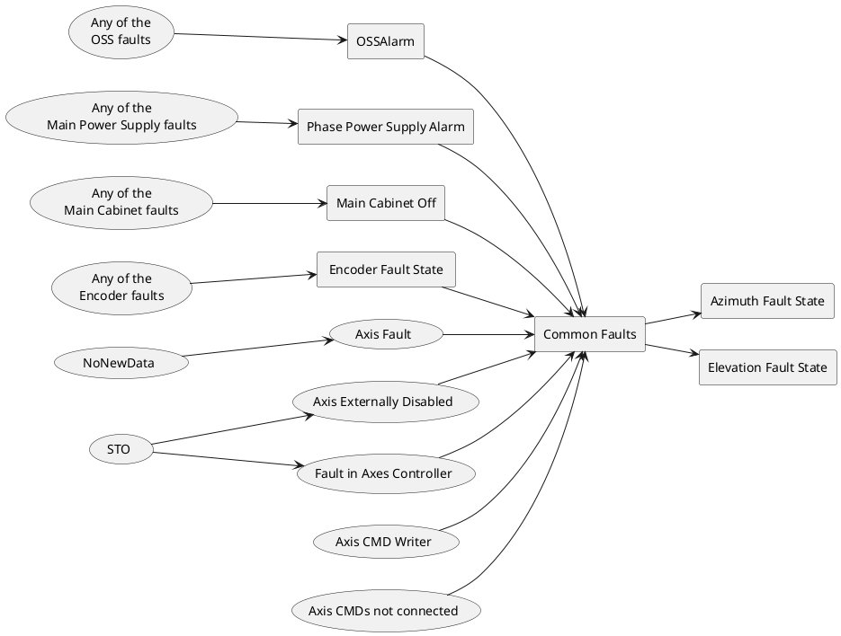

#### Azimuth individual fault tree

Here the faults that affect just Azimuth are displayed.

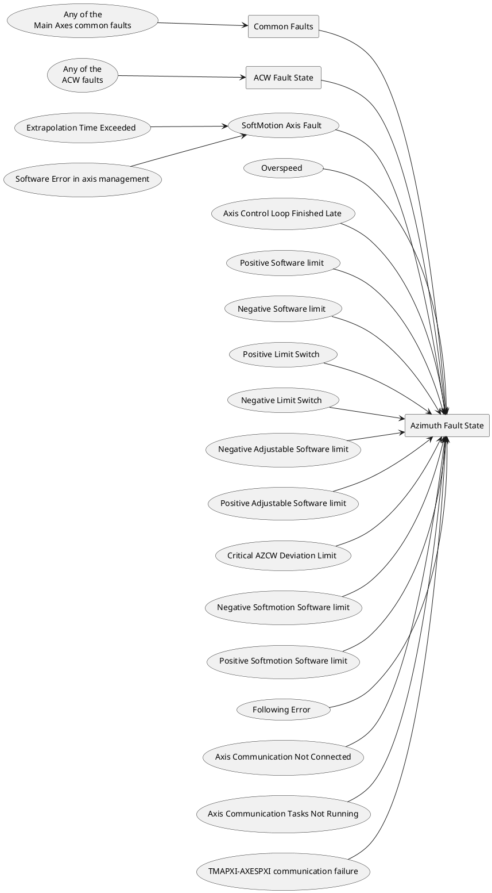

#### Elevation individual fault tree

Here the faults that affect just Elevation are displayed.

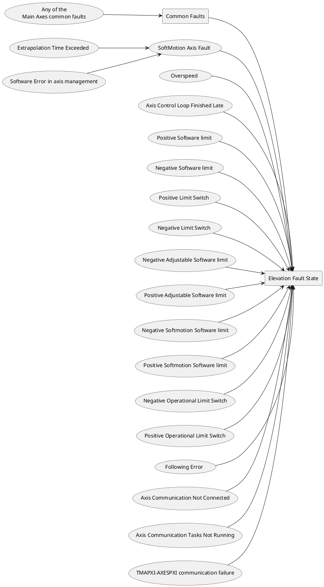

### ACW

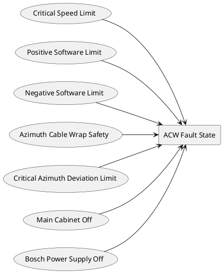

### Encoder System

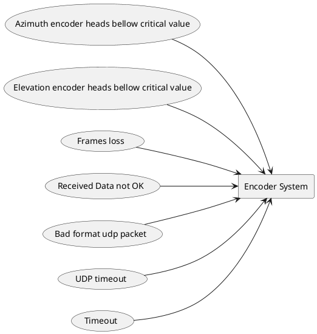

### Main Power Supply

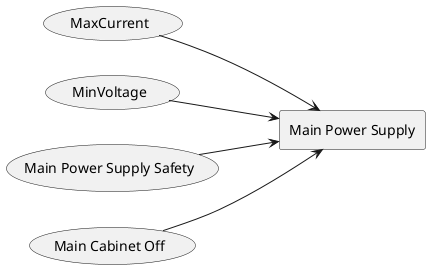

### OSS

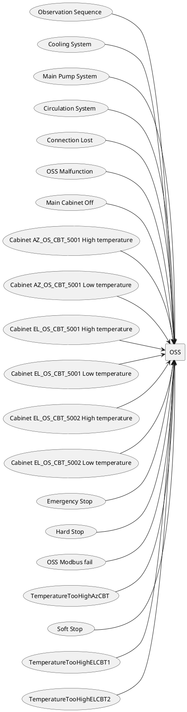

### Azimuth Drives Thermal

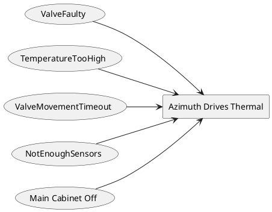

### Balancing

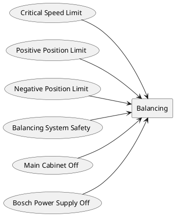

### Azimuth Cabinet 0101

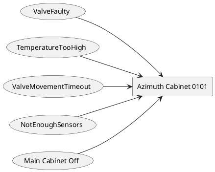

### CCW

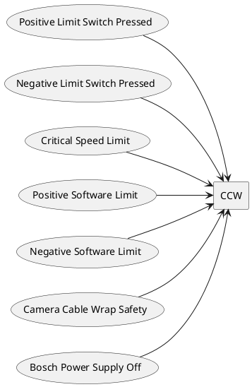

### Elevation Drives Thermal

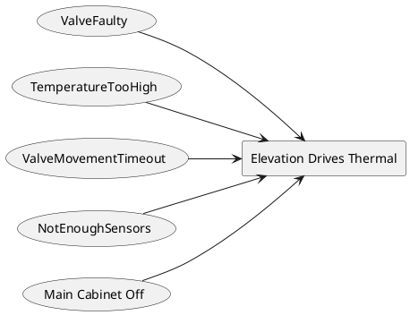

### Locking Pin

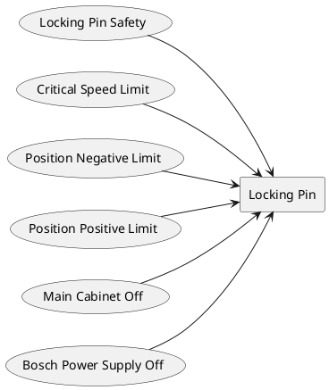

### Main Cabinet (AZ-0001)

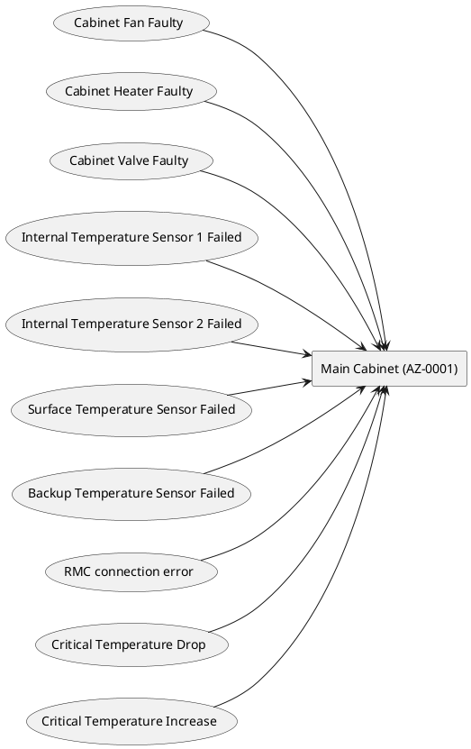

### Mirror Covers

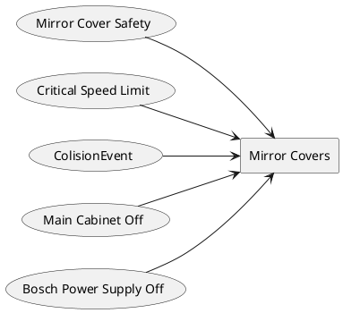

### Mirror Cover Locks

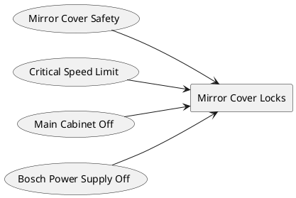

### Deployable Platforms

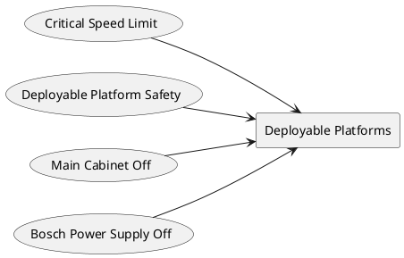

### Modbus Auxiliary Boxes (TMA_AZ_DZ_CBT_0001, TMA_AZ_PD_CBT_0001, TMA_AZ_PD_TRM_0001, TMA_EL_PD_CBT_0001, TMA_EL_PD_CBT_0002)

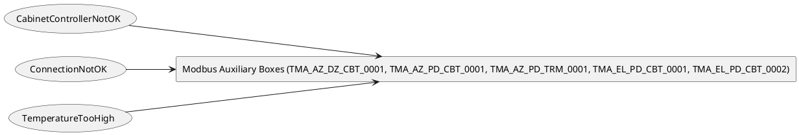

### Top End Chiller

```plantuml
@startuml
left to right direction
rectangle "Top End Chiller" as TopEndChiller
usecase "0201 3 Way valve Failure" as 02013WayValveFailure

02013WayValveFailure --> TopEndChiller
usecase "0202 3 Way valve Failure" as 02023WayValveFailure

02023WayValveFailure --> TopEndChiller
usecase "ActionTimeout" as ActionTimeout

ActionTimeout --> TopEndChiller
usecase "Air Compressed Valve Failure" as AirCompressedValveFailure

AirCompressedValveFailure --> TopEndChiller
usecase "CameraFansFailure" as CameraFansFailure

CameraFansFailure --> TopEndChiller
usecase "Electrical Cabinet 1 Control Failure" as ElectricalCabinet1ControlFailure

ElectricalCabinet1ControlFailure --> TopEndChiller
usecase "Electrical Cabinet 2 Control Failure" as ElectricalCabinet2ControlFailure

ElectricalCabinet2ControlFailure --> TopEndChiller
usecase "Electrical Cabinet 3 Control Failure" as ElectricalCabinet3ControlFailure

ElectricalCabinet3ControlFailure --> TopEndChiller
usecase "Electrical Cabinet 4 Control Failure" as ElectricalCabinet4ControlFailure

ElectricalCabinet4ControlFailure --> TopEndChiller
usecase "Heat Exchanger 1 Fan Failure" as HeatExchanger1FanFailure

HeatExchanger1FanFailure --> TopEndChiller
usecase "Heat Exchanger 2 Fan Failure" as HeatExchanger2FanFailure

HeatExchanger2FanFailure --> TopEndChiller
usecase "Humidity 0501" as Humidity0501

Humidity0501 --> TopEndChiller
usecase "Humidity 0502" as Humidity0502

Humidity0502 --> TopEndChiller
usecase "Humidity 0504" as Humidity0504

Humidity0504 --> TopEndChiller
usecase "Humidity 0505" as Humidity0505

Humidity0505 --> TopEndChiller
usecase "M2FansFailure" as M2FansFailure

M2FansFailure --> TopEndChiller
usecase "PLC Malfunction" as PLCMalfunction

PLCMalfunction --> TopEndChiller
usecase "Temperature 0501" as Temperature0501

Temperature0501 --> TopEndChiller
usecase "Temperature 0502" as Temperature0502

Temperature0502 --> TopEndChiller
usecase "Temperature 0504" as Temperature0504

Temperature0504 --> TopEndChiller
usecase "Temperature 0505" as Temperature0505

Temperature0505 --> TopEndChiller
usecase "Temperature 0506" as Temperature0506

Temperature0506 --> TopEndChiller
usecase "Temperature 0507" as Temperature0507

Temperature0507 --> TopEndChiller
usecase "Temperature Alarm Cabinet 1" as TemperatureAlarmCabinet1

TemperatureAlarmCabinet1 --> TopEndChiller
usecase "Temperature Alarm Cabinet 2" as TemperatureAlarmCabinet2

TemperatureAlarmCabinet2 --> TopEndChiller
usecase "Temperature Alarm Cabinet 3" as TemperatureAlarmCabinet3

TemperatureAlarmCabinet3 --> TopEndChiller
usecase "Temperature Alarm Cabinet 4" as TemperatureAlarmCabinet4

TemperatureAlarmCabinet4 --> TopEndChiller

@enduml
```
